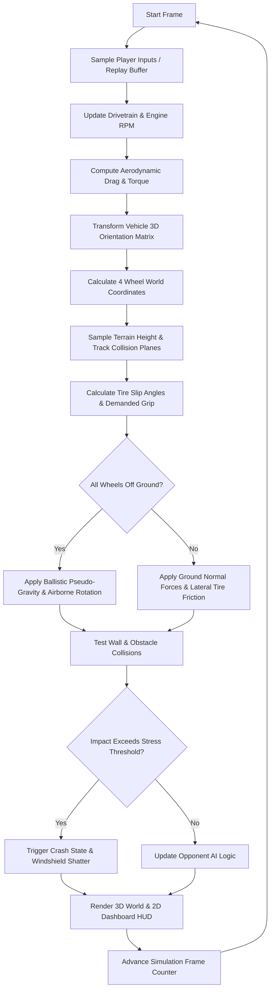

# Original Stunts Executable Architecture

## 1. System Overview & Execution Model

The original DOS release of *Stunts* (1990–1991) was engineered by Distinctive Software Inc. (DSI) for 16-bit IBM PC-compatible architectures running MS-DOS 3.0+.

```
+-------------------------------------------------------------------------+
|                              STUNTS.COM                                 |
|          (Parses SETUP.DAT -> Selects Graphics & Sound Drivers)         |
+-------------------------------------------------------------------------+
                                     | Spawns via EXEC (INT 21h AH=4Bh)
                                     v
+-------------------------------------------------------------------------+
|                               LOAD.EXE                                  |
|   (Allocates Base Segment -> Relocates EGA.CMN + Driver DIF + COD)      |
+-------------------------------------------------------------------------+
                                     | Transfers Control
                                     v
+-------------------------------------------------------------------------+
|                        STUNTS ENGINE (GAME.EXE)                         |
|  +-------------------------------------------------------------------+  |
|  | State Machine (Intro -> Menu -> SetupTrack -> RunGame -> Replay)  |  |
|  +-------------------------------------------------------------------+  |
|  | Fixed 20 Hz Simulation Loop (Input -> Engine -> Grip -> Flight)  |  |
|  +-------------------------------------------------------------------+  |
|  | Software 3D Renderer (Polygon Transform -> Frustum Clip -> Raster)|  |
|  +-------------------------------------------------------------------+  |
|  | Subsystems: Memory Manager, DSI Resource Unpacker, Sound Driver   |  |
|  +-------------------------------------------------------------------+  |
+-------------------------------------------------------------------------+
```

---

## 2. Binary Packaging, Segmentation & Memory Layout

### 2.1 The Dynamic Driver Relocation Architecture
Unlike modern games with dynamic link libraries (`.dylib` / `.dll`), 1990 MS-DOS lacked dynamic linking. DSI implemented a custom loader (`LOAD.EXE`):
1. **`EGA.CMN`** (127 KB): Contains the graphics-agnostic game logic, physics engine, file I/O, math, and menu state machines.
2. **`MCGA.DIF`** (18 KB): Contains segment fixups and byte patches applied directly onto `EGA.CMN` in memory to redirect display calls to MCGA/VGA handlers.
3. **`MCGA.COD`** (49 KB): Contains the 256-color Mode 13h rasterizer, palette manipulators, and video memory blitters.
4. **`MCGA.HDR`** (30 B): Standard MS-DOS MZ header declaring stack size, initial CS:IP, and heap requirements.

### 2.2 16-Bit Real-Mode Segmentation & Heap Layout
* **CPU Mode**: Real Address Mode (1 MB address space, segmented `segment:offset` addressing).
* **Segment Breakdown**:
  * **`SEG000` – `SEG039`** (`STUNTSC` class): Code segments. Each individual code segment is constrained to $\le 64 \text{ KB}$.
  * **`DSEG` / `DGROUP`** (`STUNTSD` class): Near data segment containing global variables, static lookup tables, and string literals (strictly $\le 64 \text{ KB}$).
  * **`STACK`**: 4,096 bytes dedicated stack space.
  * **Far Heap**: Allocated via DOS INT 21h AH=48h (allocate paragraphs). Managed by DSI's internal resource manager (`mmgr_alloc_resbytes`). Track geometry, car parameter blocks (`SIMD`), 3D models (`P3S`), and audio banks reside in far heap paragraphs.

---

## 3. Timing Model & Simulation Loop

### 3.1 Fixed 20 Hz Physics Simulation
* **Simulation Rate**: Exactly **20 ticks per second** (`framespersec = 20`, $\Delta t = 50 \text{ ms}$).
* **Hardware Timer**: Reprograms the Intel 8253/8254 Programmable Interval Timer (PIT Channel 0) via Interrupt 08h to run at 20 Hz / 100 Hz for sub-frame polling.
* **Separation of Sim and Render**: While rendering frame rates can drop under heavy polygonal loads on slow CPUs, the physics state step strictly integrates at $t = 50 \text{ ms}$ discrete quanta. Replays are recorded and replayed at this fixed 20 Hz rate.

### 3.2 Main Game Execution Loop (`RunGame`)


---

## 4. Fixed-Point Mathematics & Coordinate Space

### 4.1 Angular Units (1024-Degree Circle)
* A complete $360^\circ$ circle is mapped to **1024 integer units** (`0x400`):
  * $0^\circ = 0$
  * $90^\circ = 256$ (`0x100`)
  * $180^\circ = 512$ (`0x200`)
  * $270^\circ = 768$ (`0x300`)
* **Trigonometric Lookups**:
  * `sintab[257]`: 14-bit signed integer table where $1.0 = 16384$ ($2^{14}$).
  * `sin_fast(s)` and `cos_fast(s)` provide $O(1)$ quadrant-mapped sine/cosine operations with zero floating-point overhead.

### 4.2 Spatial Coordinate Systems
* **Track Grid**: $30 \times 30$ square tiles.
* **Tile Dimensions**: Exactly $1024 \times 1024$ spatial units.
* **World Bounds**: $(0, 0)$ to $(30720, 30720)$ units in $X$ and $Z$.
* **World Coordinates (`VECTORLONG`)**: Signed 32-bit integers:
  * $X$: Lateral East-West position.
  * $Y$: Elevation / Altitude (positive upward).
  * $Z$: Longitudinal North-South position.

---

## 5. Vehicle Simulation & Drivetrain Mechanics

The vehicle simulation is parameterized entirely through the 320-byte `struct SIMD` embedded in each vehicle's `.P3S` file:

```c
struct SIMD {
    char num_gears;                  // Number of forward gear ratios (up to 6)
    char simd_unk;
    short car_mass;                  // Vehicle curb weight
    short braking_eff;               // Brake deceleration factor
    short idle_rpm;                  // Engine idle speed (e.g. 1000 RPM)
    short downshift_rpm;             // AI / Auto downshift threshold
    short upshift_rpm;               // AI / Auto upshift threshold
    short max_rpm;                   // Redline / Engine rev limiter
    unsigned short gear_ratios[7];   // Fixed-point gear transmission ratios
    struct POINT2D knob_points[7];   // Dashboard shifter knob 2D coords
    short aero_resistance;           // Aerodynamic drag multiplier
    char idle_torque;                // Torque at idle RPM
    char torque_curve[104];          // Engine torque curve lookup table
    char field_A3;
    short grip;                      // Base tire mechanical grip
    short field_A6[7];
    short sliding;                   // Lateral slide / drift threshold
    short surface_grip[4];           // Multipliers: [Tarmac, Dirt, Ice, Grass]
    char simd_unk3[10];
    struct POINT2D collide_points[2];// Chassis collision bounding box
    short car_height;                // Center of gravity / roof clearance
    struct VECTOR wheel_coords[4];   // Local (x,y,z) offsets for 4 wheels
    char steeringdots[62];           // Speed-dependent steering lock limits
    struct POINT2D spdcenter;        // Speedometer needle center point
    short spdnumpoints;              // Speedometer calibration table size
    char spdpoints[208];             // Speedometer needle deflection angles
    struct POINT2D revcenter;        // Tachometer needle center point
    short revnumpoints;              // Tachometer calibration table size
    char revpoints[256];             // Tachometer needle deflection angles
    short far* aerorestable;         // High-speed air resistance lookup table
};
```

### 5.1 Dynamic Physics Behaviors
1. **Engine Coupling**: While on the ground, engine RPM is directly coupled to wheel rotational speed via active gear ratio (`car_speed`). During jumps or wheelspin, engine revs float according to throttle input and inertia (`car_speed2`).
2. **Surface Grip Modulation**: Each of the 4 wheels independently tests the underlying tile material (tarmac, dirt road, ice, off-track grass) and applies the corresponding friction multiplier from `surface_grip[4]`.
3. **Pseudo-Gravity & Jump Dynamics**: When `car_sumSurfAllWheels == 0` (all four wheels lose ground contact), vehicle pitch and roll continue along the angular momentum vector while vertical velocity decreases under constant gravitational acceleration (`car_pseudoGravity`).
4. **Collision Planes (`plan`)**: Track elements (banked roads, loops, ramps) provide polygonal drivable planes with predefined origin and normal vectors. Vehicle height is clamped to the plane normal, and lateral force redirects along the surface slope.

---

## 6. Rendering Pipeline

* **Display Standard**: MCGA / VGA Mode 13h ($320 \times 200$, 256 indexed colors).
* **Frame Buffers**: Double-buffered offscreen memory in conventional DOS RAM, blitted to VGA video memory at segment `0xA000` during V-blank.
* **3D Polygon Engine**:
  * Pure integer 3D pipeline using 3x3 matrix multiplication.
  * Near-plane clipping and screen viewport projection:
    $$X_{\text{screen}} = 160 + \frac{X_{\text{camera}} \cdot \text{FOV}}{Z_{\text{camera}}}, \quad Y_{\text{screen}} = 100 - \frac{Y_{\text{camera}} \cdot \text{FOV}}{Z_{\text{camera}}}$$
  * Depth Sorting: Tile-based back-to-front rendering combined with polygon object order tables.
  * Shading: Flat single-color polygon rasterization with predefined dithering patterns for translucent shadows and windshield glass.

---

## 7. Opponent AI Architecture

The computer-controlled opponent drives via a hybrid path-following and reactive state machine:
* **Track Waypoints**: Precomputed navigation paths stored in `td21_col_from_path` and `td22_row_from_path` determine the optimal tile-by-tile racing line.
* **Element Speed Codes (`si_oppSpedCode`)**: Each track item defines maximum entry and apex speeds. The AI brakes ahead of sharp corners and accelerates out of exits.
* **Persona Profiles**: Opponents (`OPP1` – `OPP6`) define aggression, maximum throttle willingness, overtaking tolerance, and error frequency.
